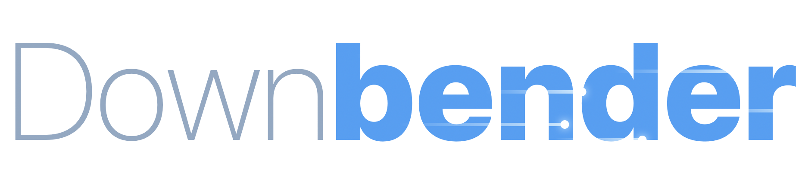
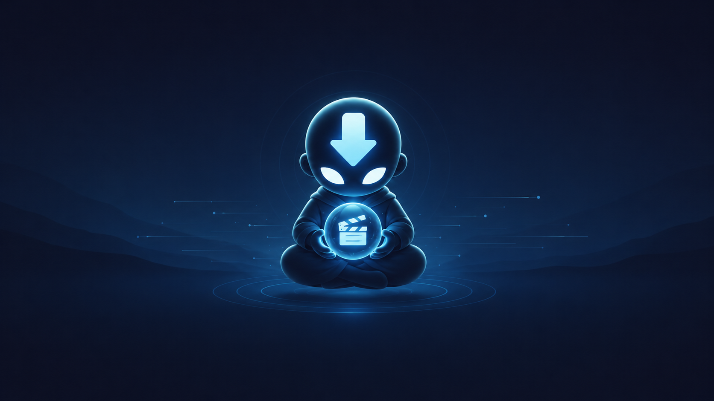
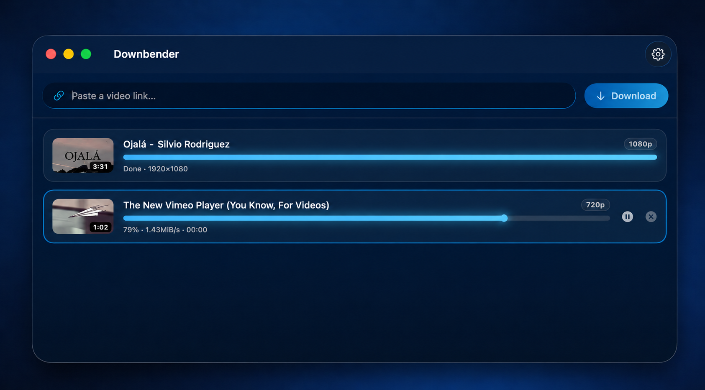

<h1 align="center">
  
</h1>



<p align="center">
  <a href="https://github.com/NaztiRS/downbender/actions/workflows/ci.yml"></a>
  <a href="https://github.com/NaztiRS/downbender/actions/workflows/ci.yml"></a>
  <a href="https://github.com/NaztiRS/downbender/releases/latest"></a>
  <a href="https://github.com/NaztiRS/downbender#requirements"></a>
  <a href="https://swift.org"></a>
  <a href="LICENSE"></a>
</p>

*The last download master.* A native macOS app that downloads videos from
YouTube and many other sites, or extracts their audio as MP3 — powered by
[yt-dlp](https://github.com/yt-dlp/yt-dlp) with an embedded FFmpeg.

## Features

- Video downloads up to 1080p (H.264/MP4) or MP3 audio extraction.
- Works with YouTube — the most battle-tested path — and [many other sites](https://github.com/yt-dlp/yt-dlp/blob/master/supportedsites.md) supported by yt-dlp (support for non-YouTube sites is still maturing).
- Download queue with per-item progress, pause/resume and cancel.
- Clipboard detection: copy a video link anywhere, confirm, download.
- Dock bounce and completion sound when a download finishes in the background.
- Self-contained: yt-dlp, FFmpeg and Deno ship inside the app. Nothing to install.
- One-click updater for the download engine (yt-dlp) in Settings.

## Requirements

- macOS 26 or later, Apple Silicon.

## Install

With [Homebrew](https://brew.sh):

```bash
brew install --cask naztirs/tap/downbender
```

Or manually:

1. Download **[Downbender.dmg](https://github.com/NaztiRS/downbender/releases/latest/download/Downbender.dmg)** (or grab it from the [website](https://naztirs.github.io/downbender/)).
2. Open the DMG and drag **Downbender** into **Applications**.
3. First launch: Downbender is not notarized by Apple (no paid developer
   account), so macOS will block it once. Go to
   **System Settings → Privacy & Security**, scroll down and click
   **Open Anyway**. This is only needed the first time.
   Terminal alternative: `xattr -dr com.apple.quarantine /Applications/Downbender.app`

## Usage



Paste a video URL (or copy one anywhere and confirm the prompt), pick a
quality or **Extract MP3**, choose a folder, download. Click a finished
row to reveal the file in Finder.

- **Age-restricted / members-only videos:** set **Settings → Privacy →
  Browser cookies** to the browser where you're signed in. macOS may ask
  for permission once.
- **Downloads suddenly failing?** YouTube changes constantly. Use
  **Settings → Downloader (yt-dlp) → Check for updates** to update the
  engine without reinstalling the app.

## Build from source

Requires macOS 26+ with Command Line Tools (full Xcode not needed).

```bash
./scripts/fetch-binaries.sh   # once: downloads yt-dlp, FFmpeg (GPL build) and Deno
./scripts/make-dmg.sh         # builds Downbender.dmg
# or, for a quick run:
./scripts/bundle.sh && open Downbender.app
```

With [pnpm](https://pnpm.io) installed, every task is one short command:

| Command | What it does |
| --- | --- |
| `pnpm check` | Lint, build and run the tests — the same gate CI enforces |
| `pnpm build` | Compile the package (`swift build`) |
| `pnpm test` | Run the test suite (CLT-safe wrapper around `swift test`) |
| `pnpm lint` | SwiftFormat in lint mode + SwiftLint, no changes applied |
| `pnpm format` | Apply SwiftFormat fixes in place |
| `pnpm bundle` | Build `Downbender.app` |
| `pnpm dmg` | Build the distributable DMG and the self-updater zip |
| `pnpm release` | Cut a full release: tests → DMG/zip → tag → GitHub release → cask bump |
| `pnpm cask` | Sync the Homebrew cask with the published release |
| `pnpm binaries` | Download yt-dlp, FFmpeg and Deno (first-time setup) |

Tests: `./scripts/test.sh` (plain `swift test` silently runs 0 tests with
Command Line Tools only).

Contributing? Run `pnpm install` once — [husky](https://typicode.github.io/husky/)
wires the git hooks: lint + build on every commit, the test suite on every
push (linters via `brew install swiftformat swiftlint`).

## Responsible use

Downbender is a frontend for yt-dlp intended for downloading content you
have the right to download (your own uploads, public-domain or
appropriately licensed material). Downloading videos may violate the
terms of service of some platforms; you are responsible for how you use
this tool. Downbender does not circumvent DRM.

## License

GPLv3 — see [LICENSE](LICENSE). Bundled third-party components are listed
in [NOTICE](NOTICE).
