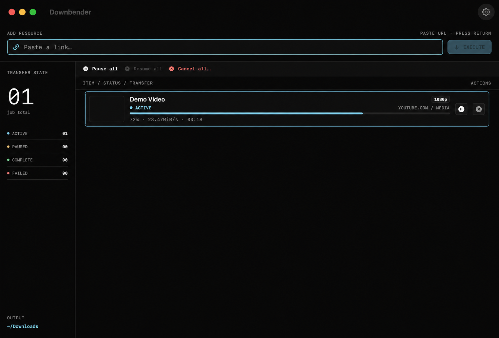

<p align="center">
  
</p>

<h1 align="center">Downbender</h1>

<p align="center"><em>The last download master.</em></p>

<p align="center">
  A native download manager for macOS with no Downbender account. Bring videos,<br>
  playlists, audio, and direct files into one persistent queue.
</p>

<p align="center">
  <a href="https://github.com/NaztiRS/downbender/releases/latest/download/Downbender.dmg"><strong>Download the latest DMG</strong></a>
  · <a href="https://naztirs.github.io/downbender/">Website</a>
  · <a href="https://github.com/NaztiRS/downbender/releases">Releases</a>
</p>

<p align="center">
  <a href="https://github.com/NaztiRS/downbender/actions/workflows/ci.yml"></a>
  <a href="https://github.com/NaztiRS/downbender/releases/latest"></a>
  <a href="#requirements"></a>
  <a href="https://swift.org"></a>
  <a href="LICENSE"></a>
</p>

<p align="center">
  
</p>

Downbender saves video at the quality you choose, extracts MP3, M4A, or Opus audio,
and downloads direct files as-is. It is powered by
[yt-dlp](https://github.com/yt-dlp/yt-dlp), with FFmpeg and Deno bundled inside the app.

## Highlights

### Media and playlists

- Choose from the resolutions detected for an individual video. Through 1080p, Downbender
  prefers an MP4-compatible profile; above 1080p it uses MKV. The video is not transcoded,
  so a fallback source can retain a different compatible container.
- Extract **MP3**, **M4A**, or **Opus** audio from a single video or selected playlist entries.
- Review a playlist before it starts: choose individual entries, all of them, or none,
  apply one video or audio output to the selection, and see an estimated total size.
- Optionally embed creator-provided subtitles in video downloads. Automatic captions and
  live chat are not downloaded.
- Use YouTube—the most battle-tested path—and
  [many other sites](https://github.com/yt-dlp/yt-dlp/blob/master/supportedsites.md)
  supported by yt-dlp. Support outside YouTube can vary as sites change.

### One queue for everything

- Keep a persistent queue with **1–4 simultaneous downloads** and per-item or batch pause,
  resume, cancel, retry, and clear controls. Queued and paused items can be reordered.
- Quit safely: unfinished work is paused and restored after relaunch, with resumable data
  reused when the source permits it.
- Paste or drop one link or many HTTP(S) links at once. Copying a supported media link can
  also trigger a confirmation prompt; <kbd>⇧</kbd><kbd>⌘</kbd><kbd>V</kbd> runs
  **Paste and Download**.
- Drag a completed item from the queue into Finder, or click it to reveal the downloaded file.
- Monitor and control the queue from the menu bar and Dock, including overall progress,
  **Pause All / Resume All**, completed-file reveal, and actionable completion notices.

### Direct files, handled natively

- Save known direct links to archives, documents, images, installers, and raw media without
  sending them through yt-dlp. Downbender confirms the name, size when available, and folder
  before starting.
- When a URL could be either raw media or a page, choose whether to download it as-is or
  process it with yt-dlp.
- Direct downloads warn before plaintext HTTP, block HTTPS-to-HTTP downgrades, check known
  sizes against free space, sanitize server-provided names, avoid overwriting existing files,
  and apply macOS quarantine metadata.

### Stable by default, current when needed

- Bundled **stable yt-dlp**, FFmpeg, and Deno keep the normal path self-contained and usable
  offline.
- Install a separately verified **yt-dlp nightly** on demand when a site needs a newer fix.
  Stable always remains available. **Try latest fixes** installs and selects the verified
  nightly, retries the failed media item, and lets you return to Stable at any time.
- Every failed item offers a bounded, privacy-safe diagnostic report. Eligible yt-dlp failures
  can also retry with detailed logging. Reports redact full web URLs, common local paths,
  cookie headers, and recognized credential fields before display or copy; nothing is sent
  automatically.
- Optional app updates download in the background and wait for you to choose when to restart.

## Requirements

- macOS 26 or later.
- Apple Silicon.

## Install

With [Homebrew](https://brew.sh):

```bash
brew install --cask naztirs/tap/downbender
```

Or manually:

1. Download **[Downbender.dmg](https://github.com/NaztiRS/downbender/releases/latest/download/Downbender.dmg)**.
2. Open the DMG and drag **Downbender** into **Applications**.
3. Downbender is ad-hoc signed and not Apple-notarized, so macOS may block the first launch.
   If you downloaded the official DMG and trust it, open **System Settings → Privacy &
   Security**, scroll down, and click **Open Anyway**. You only need to do this once.

Terminal alternative for step 3, only after verifying that you trust the downloaded app:

```bash
xattr -dr com.apple.quarantine /Applications/Downbender.app
```

## Quick start

1. Paste a video or direct-file URL into **Add Resource**. You can also paste or drop several
   links together, accept the clipboard prompt for a copied media link, or send a page from
   the browser extension.
2. Confirm what should happen:

   - For one video, choose a video quality or MP3, M4A, or Opus.
   - For a playlist, review the entries, select the ones you want, and choose one output.
   - For a direct file, confirm its name, size when known, and destination.

3. Choose a folder and execute. Reorder or control items individually, or use the batch
   controls for the whole queue.
4. Click a completed row to reveal the file in Finder.

Set a default quality—including **Maximum available**—or an audio format in **Settings →
General**. You can also enable **Download immediately** to skip the output chooser for
confirmed single-video links. For that one-click path, **Maximum available** resolves to the
highest detected resolution. Playlists, ambiguous URLs, and direct files still ask for the
decisions they need.

### Output guide

| Choice | Result |
| --- | --- |
| Detected resolution through **1080p** | Closest available resolution at or below the choice, using an MP4-compatible profile when the source offers one |
| Detected resolution above **1080p** | Closest available resolution at or below the choice, using an MKV profile |
| Playlist **Maximum available** | Highest streams available for each selected entry, using MKV |
| **MP3 / M4A / Opus** | Audio extracted with the selected output format |
| **Creator subtitles** | Embedded in video outputs when the source provides them |
| **Direct file** | Original payload saved as-is with a safe filename |

## Useful settings and recovery

- **Restricted or members-only media:** choose an installed Google Chrome, Brave,
  Microsoft Edge, Chromium, Safari, or Firefox browser under **Settings → Privacy → Browser
  cookies**. Sign in to the site in that browser first; macOS may request permission once.
- **File names:** open **Settings → General → File names** for ready-made templates and a live
  example. **Custom…** accepts safe yt-dlp fields such as title, uploader, and upload date;
  keep `%(ext)s` at the end. Templates affect future media downloads, while direct files keep
  the safe form of the server-provided name.
- **A media site suddenly stopped working:** select **Try latest fixes** on the failed item or
  switch between **Stable** and **Nightly** under **Settings → Download engine**. Downbender
  verifies the official nightly checksum and version before using it.
- **Understand a failure:** open the failed item's info panel and copy its privacy-safe report.
  For an eligible yt-dlp failure, you can retry the same item with detailed logging without
  changing its destination or output.

## Browser extension

The optional extension supports Google Chrome, Brave, Microsoft Edge, and Chromium without a
browser-store account. Open **Settings → Browser extension**, choose a browser, and click
**Install extension**. Downbender creates a temporary shortcut in Downloads and opens the
browser's extension screen. Then:

1. Enable **Developer mode**.
2. Click **Load unpacked**, choose **Downloads** in the sidebar, and select
   `Downbender Extension Installer`.
3. Once the browser loads it, Downbender removes the temporary shortcut automatically. It is
   also removed when the app quits or after one hour.

The app registers its native-messaging helper automatically. The page overlay appears only
when a sufficiently large video is playing or its hover preview is advancing. Use the toolbar
button or **Download with Downbender** in the context menu when a site's player cannot expose
an overlay.

## Build from source

Requires macOS 26+ with Command Line Tools; full Xcode is not required. Install the JavaScript
dependencies and bundled runtimes before building an app that can download:

```bash
pnpm install
pnpm binaries                 # required once: yt-dlp, FFmpeg/ffprobe, and Deno
pnpm bundle
open Downbender.app
```

Creating a DMG also requires `create-dmg`:

```bash
brew install create-dmg
pnpm dmg
```

With [pnpm](https://pnpm.io) installed, every task is one short command:

| Command | What it does |
| --- | --- |
| `pnpm check` | Run the full local gate: lint, extension checks, build, and tests |
| `pnpm build` | Compile the Swift package |
| `pnpm test` | Run the test suite with the Command Line Tools-compatible wrapper |
| `pnpm lint` | Run SwiftFormat in lint mode and SwiftLint without changing files |
| `pnpm extension:check` | Syntax-check the extension and run its JavaScript tests |
| `pnpm format` | Apply SwiftFormat fixes in place |
| `pnpm bundle` | Build `Downbender.app` |
| `pnpm dmg` | Build the distributable DMG and self-updater zip |
| `pnpm release` | Maintainers: test, package, tag, publish a release, and push the cask update |
| `pnpm cask` | Maintainers: sync and push the Homebrew cask for the published release |
| `pnpm binaries` | Download yt-dlp, FFmpeg, and Deno for first-time setup |

Plain `swift test` silently runs zero tests with Command Line Tools only, so use `pnpm test`
or `./scripts/test.sh`.

Contributing? Run `pnpm install` once. [Husky](https://typicode.github.io/husky/) wires the
Git hooks: lint and build on every commit, then the test suite on every push. Install the
linters with `brew install swiftformat swiftlint`.

## Responsible use

Downbender is a frontend for yt-dlp intended for content you have the right to download,
including your own uploads and public-domain or appropriately licensed material. Downloading
videos may violate a platform's terms of service; you are responsible for how you use this
tool. Downbender does not circumvent DRM.

## License

GPLv3—see [LICENSE](LICENSE). Bundled third-party components are listed in [NOTICE](NOTICE).
